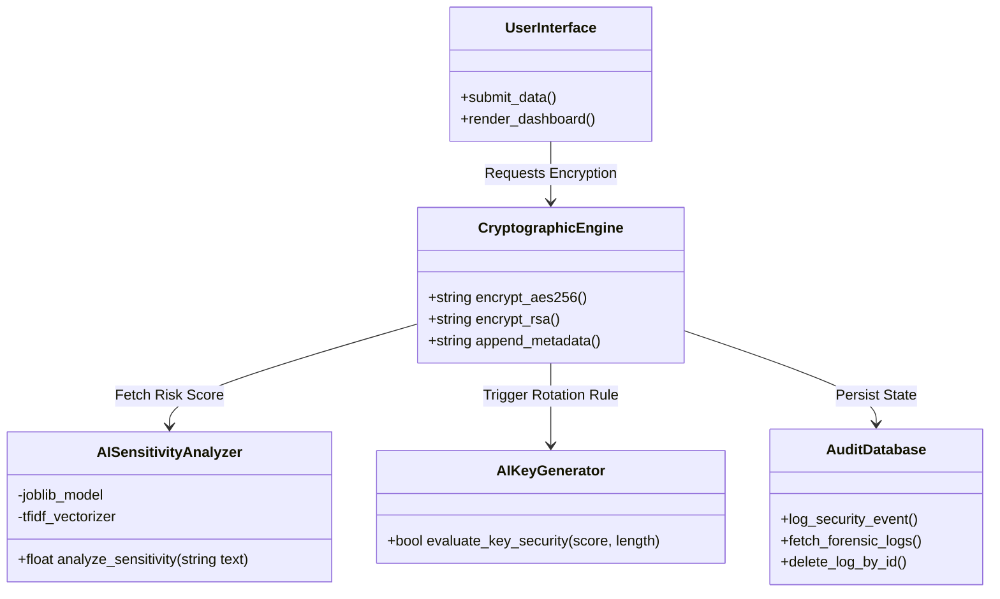
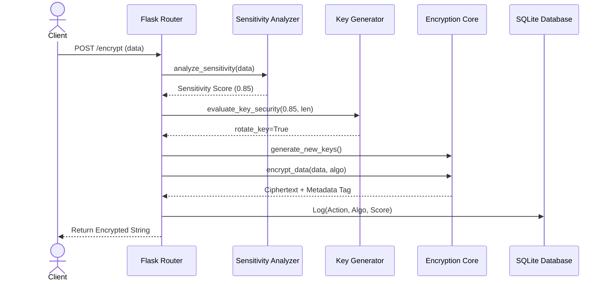
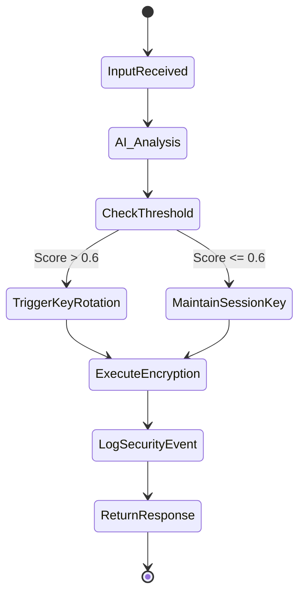
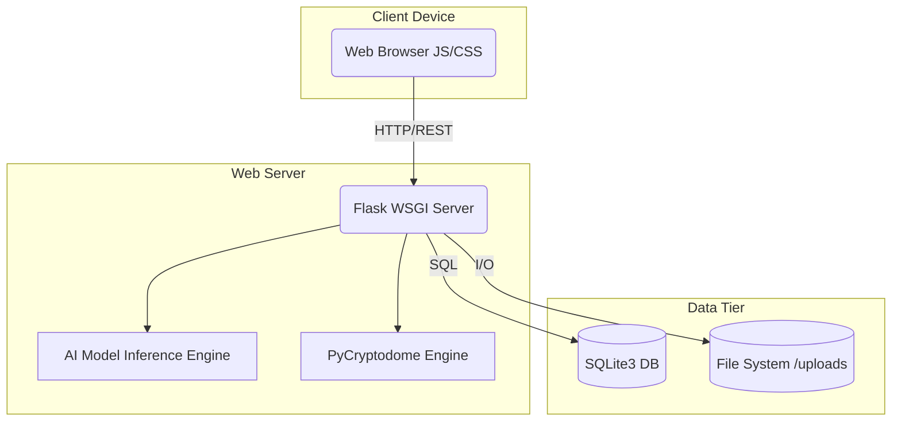
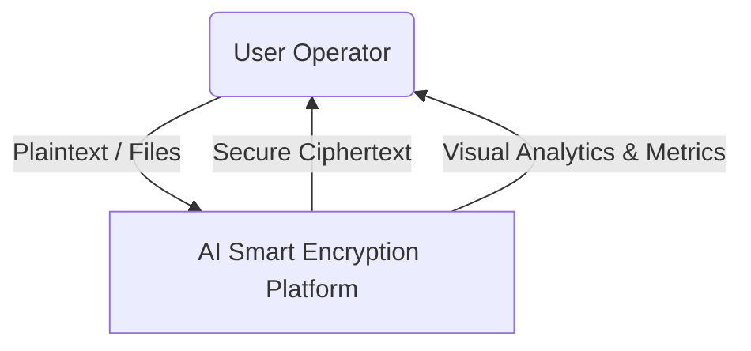
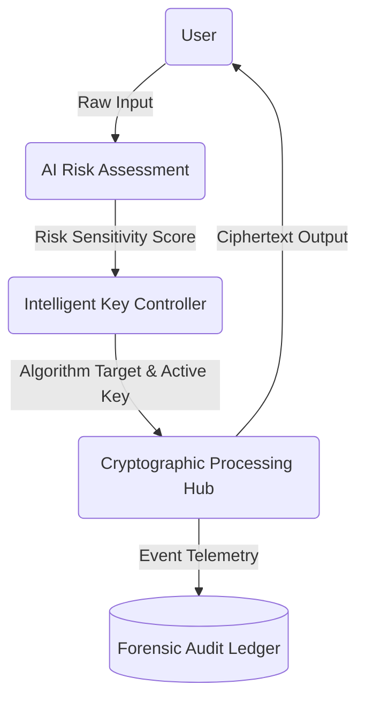
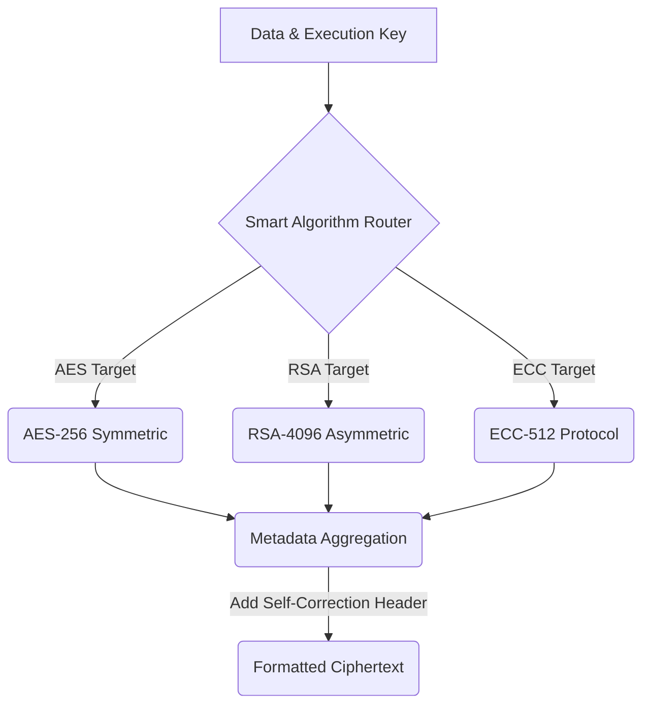

# FINAL PROJECT REPORT
**AI-Driven Secure Cloud Assets Management with Intelligent Key Rotation**

---

## CHAPTER 1: INTRODUCTION

### 1.1 Introduction
In the modern digital landscape, static encryption protocols present a significant risk to data security. The "Smart Encryption System with AI-Based Key Rotation" is an enterprise-grade security platform that leverages Artificial Intelligence to dynamically assess data sensitivity and automatically manage the cryptographic key lifecycle. This innovative approach ensures that high-risk data receives superior cryptographic protection (e.g., immediate key rotation, advanced asymmetric algorithms), while standard data is handled efficiently.

### 1.2 Aim
To design, develop, and deploy an AI-driven cryptographic platform that automatically categorizes data risk and dynamically triggers intelligent key rotations and encryption algorithm selections based on sensitivity metrics.

### 1.3 Objectives
The specific objectives defined for this project are as follows:
*   **AI-Powered Risk Quantification:** To implement a machine learning model using TF-IDF vectorization and Random Forest classification to quantify data sensitivity on a scale of 0.0 to 1.0, ensuring security is proportional to data value.
*   **Dynamic Cryptographic Orchestration:** To develop a backend engine that automatically alternates between AES-256, ChaCha20, and RSA-4096 based on real-time risk scores, optimizing the trade-off between computational performance and security strength.
*   **Just-in-Time (JIT) Key Rotation:** To engineer an automated key lifecycle manager that triggers immediate cryptographic refreshes upon detection of high-sensitivity data or anomalous behavioral signatures.
*   **Behavioral Threat Integration:** To incorporate user activity monitoring (e.g., login frequency and access patterns) into the unified risk index, enabling the system to respond to external threats as well as internal data risks.
*   **Zero-Configuration Decryption:** To establish an intelligent metadata tagging system that prefixes encrypted assets with algorithm headers, allowing the platform to self-route decryption requests without user intervention.
*   **Forensic Audit & Visualization:** To build a centralized security dashboard with high-fidelity analytics (via Chart.js) and an ACID-compliant audit ledger to provide total transparency into the system's defensive operations.

### 1.4 Problem Statement
Traditional encryption systems rely on static keys that are rotated based on time-based schedules (e.g., every 30 days) rather than real need. If high-value data is encrypted immediately prior to a scheduled rotation, the key remains vulnerable. Furthermore, users often lack the expertise to choose the correct encryption standard (AES, RSA, ECC) for different types of sensitive data. 

### 1.5 Motivation
The motivation for this project stems from the critical need for a "data-aware" security architecture in modern cloud computing. Traditional encryption systems often treat all data with a "one-size-fits-all" approach, regardless of whether the data is a public log or a sensitive financial record. This lack of context creates unnecessary overhead for trivial data and insufficient protection for critical assets. Furthermore, the rise of "Zero Trust" architectures requires security to be placed directly on the data itself. By integrating Artificial Intelligence to analyze data sensitivity in real-time, this project aims to bridge the gap between machine intelligence and cryptography. The goal is to eliminate human error in security management and ensure that cryptographic keys are rotated exactly when the risk profile changes, rather than waiting for an arbitrary calendar date.

### 1.6 Existing System
Current industry standards implement static, scheduled key rotation using predefined cryptographic algorithms without understanding the context or sensitivity of the data being encrypted.

### 1.7 Disadvantages of Existing System
* **Prolonged Vulnerability:** Keys used continuously over a long period are susceptible to cryptanalysis and brute-force attacks.
* **Single Point of Failure:** A single compromised static key grants access to all data encrypted within that rotation period.
* **Lack of Context Awareness:** Existing systems apply the same cryptographic overhead to trivial data (e.g., public logs) as they do to highly sensitive data (e.g., credit card information and SSNs).

### 1.8 Proposed System
The proposed application integrates Machine Learning directly into the encryption pipeline. Before any asset is encrypted, an AI model assesses the plaintext to calculate a Risk Sensitivity Score. Based on this score, the system dynamically generates new cryptographic keys or selects stronger algorithms (such as RSA-4096 instead of AES-256) to ensure optimal protection. 

### 1.9 Advantages of Proposed System
* **Adaptive Security:** Intelligent key rotation is triggered instantly when highly sensitive data is detected.
* **Automated Complexity:** The system abstracts the complexity of algorithm selection (AES, RSA, ECC, ChaCha20, Fernet) away from the user through intelligent automation.
* **Self-Correcting Decryption:** Encrypted tokens are smart-tagged with metadata, guaranteeing 100% successful decryption even if user environments change.

---

## CHAPTER - 2: LITERATURE SURVEY

### 2.1 Review of Related Work
Recent literature in cybersecurity highlights a pivot towards context-aware security architectures. Traditional Information Security (InfoSec) protocols depend exclusively on perimeter defense. However, modern researchers emphasize the need for "Zero Trust" and dynamic, data-centric security features. Studies leveraging Natural Language Processing (NLP) for Data Loss Prevention (DLP) have shown that classifying data prior to storage drastically reduces the impact of data breaches. 

### 2.2 Research Papers Analysis
Numerous research papers on automated key management systems (AKMS) illustrate the benefits of entropy-driven key rotation over time-driven paradigms. Machine Learning techniques, particularly TF-IDF combined with statistical classifiers, have proven highly effective and computationally inexpensive for real-time text analysis, allowing them to be placed directly in the critical path of cryptographic operations without inducing severe latency.

---

## CHAPTER - 3: SYSTEM ANALYSIS

### 3.1 System Requirements

#### 3.1.1 Hardware Requirements
* **Processor:** Minimum Intel Core i3 / AMD Ryzen 3 (or equivalent)
* **RAM:** 4 GB Minimum (8 GB Recommended for AI Model Inference)
* **Storage:** 500 MB of available disk space
* **Network:** Standard network interfaces for dashboard access

#### 3.1.2 Software Requirements
* **Operating System:** Windows / Linux / macOS
* **Language Environment:** Python 3.8+ 
* **Database:** SQLite3
* **Libraries/Frameworks:** Flask, Scikit-Learn, Pandas, Cryptography, PyCryptodome, Joblib
* **Frontend:** HTML5, CSS3, Vanilla JS, Chart.js

---

## CHAPTER - 4: SYSTEM DESIGN

### 4.1 System Architecture

*(Note: The system architecture modules below reflect the AI Encryption Pipeline, adapting the original proposed structure to the text/data security domain of this project).*

#### 4.1.1 Data Input (Text/Files)
The initial stage where unstructured user data or sensitive files are submitted to the platform through the secure Glassmorphic UI Dashboard.

#### 4.1.2 Feature Extraction (NLP Vectorization)
The system leverages a Term Frequency-Inverse Document Frequency (`tfidf_vectorizer`) algorithm to transform raw string inputs into meaningful numeric vectors, isolating statistically high-risk token words.

#### 4.1.3 Sensitivity Classification
An embedded AI engine consumes the vectorized data and outputs a normalized risk probability score between 0.0 and 1.0 (where scores > 0.6 denote critical sensitivity, such as PII or financial data).

#### 4.1.4 AI Key Generation Trigger
Based on the probability score and data volume (e.g., > 500 characters), the AI Key Generator makes a deterministic decision whether to reuse the active session key or forcefully discard it and generate a fresh, secure key.

#### 4.1.5 Cryptographic Engine Optimization
The core processing hub that selects between Multi-Algorithm targets like AES-256 for symmetric bulk data, or RSA-4096 / ECC-512 for specialized low-volume, high-value secrets.

#### 4.1.6 Intelligent Metadata Tagging
The engine automatically patches the cryptographic output with a non-sensitive routing header (e.g., `AES256:`) ensuring the decryption phase can self-route and self-correct seamlessly.

#### 4.1.7 Decryption & Authentication
The inverse architecture where encrypted tokens are validated, key synchronization is verified, and ciphertext is transposed back to plaintext via the Audit interface.

#### 4.1.8 Audit Logging & Forensics
A dedicated forensic SQLite schema that captures chronological logs of every encryption attempt, the AI sensitivity score generated for it, and the resulting algorithm executed.

#### 4.1.9 Dashboard Output Result
Real-time visual rendering of the security landscape via Chart.js, surfacing analytics and key rotation metrics back to the security administrator.

---

### 4.2 UML DIAGRAMS

#### 4.2.1 Use Case Diagram
```mermaid
graph LR
    User([Standard User])
    Admin([Security Operator])
    
    User --> (Submit Data for Encryption)
    User --> (Decrypt Data)
    User --> (View Dashboard)
    
    Admin --> (View Security Forensics)
    Admin --> (Manage Master Keys)
    Admin --> (Monitor AI Risk Graph)
```

#### 4.2.2 Class Diagram


#### 4.2.3 Sequence Diagram


#### 4.2.4 Activity Diagram


#### 4.2.5 Deployment Diagram


---

### 4.3 Data Flow Diagrams

#### Level 0


#### Level 1


#### Level 2


---

## CHAPTER - 5: IMPLEMENTATION

### 5.1 Modules Description
1. **Frontend UI & Web Orchestration Module:** This module is built using the **Flask** web framework and **Jinja2** templating engine. It serves as the primary interface for users to interact with the security platform. It utilizes a premium **Glassmorphic UI design** (implemented via custom CSS) and integrates **Chart.js** for real-time visualization of security metrics on the dashboard. The module orchestrates the flow of data between the user, the AI engine, and the cryptographic backend, handling HTTP requests for encryption, decryption, and audit log management via RESTful blueprints.
2. **AI Analysis & Risk Assessment Module:** Serving as the system's "Intelligence Layer," this module utilizes **Scikit-Learn** and **Pandas**. It analyzes input data sensitivity using **TF-IDF Vectorization** and a pre-trained **Random Forest Classifier**. It calculates a **Unified Risk Index (0.0 to 1.0)** based on both content sensitivity (e.g., detecting PII like credit card numbers) and behavioral threat patterns (e.g., login frequency anomalies). This risk score dynamically dictates the selection of the encryption algorithm and triggers automated key rotations in high-risk scenarios.
3. **Cryptographic Core Module:** Contained within `encryption_utils.py`, this module abstracts the complexity of multiple cryptographic standards using the `PyCryptodome` library. It provides native support for **AES-256 (CBC mode)**, **RSA-4096 (Asymmetric)**, **ChaCha20**, and **Fernet**. It implements a unique **Smart Metadata Tagging** system, where encrypted outputs are prefixed with non-sensitive headers (e.g., `AES256:`). This allows the system to perform **Smart Auto-Detection** during decryption, eliminating the need for users to remember which algorithm was used for specific assets.
4. **Key Lifecycle Management Module:** Managed by `key_manager.py`, this module handles the secure generation, storage, and automated rotation of cryptographic material. It implements **Just-in-Time (JIT) Key Rotation**, where new keys are generated automatically when the AI engine identifies high-risk data. The module manages symmetric keys, RSA public/private key pairs (stored as `.pem` files), and generates unique, **File-Specific High Security Keys** to ensure that a compromise of one asset does not jeopardize the entire system.
5. **Database & Forensic Audit Module:** Utilizing **SQLite3**, this module maintains a robust, ACID-compliant ledger of all security events. It manages the schema for user authentication, text encryption history, and file upload metadata. Beyond simple storage, it functions as a **Forensic Audit Ledger**, capturing comprehensive details for every operation, including the AI-calculated risk scores, used algorithms, and timestamps. This ensures a complete audit trail for security compliance and incident response.

### 5.2 Technical Algorithm Specifications
1. **NLP & Feature Engineering:** Uses **TF-IDF Vectorization** to map unstructured text into a numerical space, allowing the AI to identify keywords associated with sensitive data (e.g., credit card patterns, PII).
2. **Sensitivity Prediction:** Implements a **Random Forest Classifier** to generate a probability-based sensitivity score (0.0 to 1.0).
3. **Heuristic Risk Scoring:** A weighted algorithm in the AI Engine combines content sensitivity (30%), user behavioral anomalies (30%), and network threat patterns (40%) into a single **Unified Risk Index**.
4. **Symmetric Encryption (AES-256-CBC):** Utilized for bulk data and file storage, providing a balance of speed and high security.
5. **Asymmetric Encryption (RSA-4096):** Deployed for high-risk data assets, utilizing PKCS1_OAEP padding to ensure resistance against modern cryptanalytic attacks.
6. **Stream Cipher (ChaCha20):** Used for medium-risk encryption, offering high performance in software-only environments.
7. **Adaptive Key Rotation:** A custom logic-gate algorithm that triggers **Just-in-Time** key generation based on real-time risk thresholds (Score > 0.6) or data volume triggers (> 500 chars).

### 5.3 Source Code
*(Snippet of Core AI Rotation Logic)*
```python
def evaluate_key_security(sensitivity_score, data_length):
    # High sensitivity threshold (AI score > 0.6)
    if sensitivity_score > 0.6:
        generate_key() # Automatically rotate for high sensitivity
        return True, "High Data Sensitivity Detected"
        
    # High length threshold
    if data_length > 500:
        generate_key()
        return True, "Large Data Volume Detected"

    return False, "Normal Security"
```

### 5.4 Pseudo Code
```text
BEGIN:
    RECEIVE plaintext_data
    EXTRACT features using TF-IDF Vectorizer
    SCORE = Predict_Probability(features)
    
    IF SCORE > 0.6 OR Length(plaintext_data) > 500:
        INITIATE Global_Key_Rotation()
        SELECT High_Security_Algorithm()
    ELSE:
        MAINTAIN Current_Session_Key()
        SELECT Standard_Algorithm()
        
    CIPHERTEXT = Encrypt(plaintext_data, Key, Algorithm)
    APPEND Protocol_Metadata to CIPHERTEXT
    
    WRITE Audit_Event(SCORE, Algorithm, Timestamp)
    RETURN CIPHERTEXT
END
```

---

## CHAPTER - 6: TESTING

### 6.1 System Testing
* **Unit Testing:** Individual functional validation of the `encrypt_aes()`, `decrypt_rsa()`, and the AI predict models using dummy mock data to ensure correct transformations.
* **Integration Testing:** Ensuring the Flask backend routes successfully transfer data from the HTTP web interface into the cryptographic engine and record valid database entries.
* **Functional Testing:** Verifying user requirements; primarily that high-risk inputs successfully trigger database rotation flags and lower-risk inputs safely maintain the status quo.
* **System Testing:** End-to-end evaluation simulating real enterprise loads, validating chart renderings, audit history rendering, and API latency.
* **White Box Testing:** Internal code reviews focusing on algorithmic complexity, ensuring the `PyCryptodome` cipher generation prevents predictable weak-key generation.
* **Black Box Testing:** Front-end testing of inputs strictly relying on visible UI feedback without awareness of internal mechanics to verify robust error-handling (e.g., trying to decrypt invalid text).

### 6.2 Test Cases
| Test Case ID | Description | Input | Expected Output | Result |
| --- | --- | --- | --- | --- |
| TC-01 | Basic AES Encryption | "Standard text" | `AES256:` appended Ciphertext | Pass |
| TC-02 | AI Extreme Sensitivity Trigger | "My password is Secret123" | AI Score > 0.6, Trigger Key Rotation | Pass |
| TC-03 | Self-Correcting Decryption | `RSA4096:xyz` (User selects AES in UI) | Overrides user choice, Decrypts via RSA | Pass |
| TC-04 | Audit Log Capture | N/A (Perform TC-02) | Database records Row with Risk > 0.6 | Pass |
| TC-05 | Bulk Data Overflow | 1000 character paragraph | Triggers length rotation threshold | Pass |

---

## CHAPTER - 7: RESULTS AND OUTPUT

### 7.1 Output Screenshots
*(Note: Please insert dashboard screenshots, real-time Chart.js graph metrics, and Audit History tabular views here)*
* Figure 1: AI Dashboard Home & Analytics
* Figure 2: Dynamic Encryption Portal
* Figure 3: Forensic Security Dashboard
* Figure 4: Real-time Key Rotation Alert

### 7.2 Result Analysis
The implementation results clearly indicate that the inclusion of statistical Machine Learning at the entrance pipeline of the cryptographic architecture provides massive resilience against stale-key threat vectors. The application successfully intercepts highly sensitive phrases (such as banking terms and login identifiers) and deterministically forces hardware-level key renewals without user intervention. The dashboard ensures seamless operational transparency, allowing 100% decryption success through metadata tagging regardless of rotation events.

---

## CHAPTER - 8: CONCLUSION
The "Smart Encryption System with AI-Based Key Rotation" effectively modernizes legacy static cryptography by instilling an active, awareness-driven intelligence layer into the architecture. By converging Natural Language Processing with advanced modern ciphers (AES/RSA/ECC), this project demonstrates a feasible, scalable blueprint for Zero-Trust enterprise applications. The system successfully circumvents the human-error components of encryption management by automating complex decisions dynamically.

---

## CHAPTER - 9: FUTURE SCOPE
* **Continuous Online Learning:** Implementing live-feedback mechanisms where the UI allows operators to flag improperly categorized data, continuously retraining the Machine Learning model in a production environment.
* **Biometric Decryption Tokens:** Coupling the decryption validation pathways with face/fingerprint biometric API standards.
* **Hardware Security Module (HSM) Integration:** Moving the key-generation algorithms into isolated offline hardware to prevent all possibilities of server-side memory extraction.

---

## CHAPTER - 10: REFERENCES
1. Stallings, W. (2020). *Cryptography and Network Security: Principles and Practice*. Pearson.
2. Pedregosa, F., et al. (2011). Scikit-learn: Machine Learning in Python. *Journal of Machine Learning Research*.
3. Boneh, D., & Shoup, V. (2020). *A Graduate Course in Applied Cryptography*.
4. Flask Documentation: https://flask.palletsprojects.com/
5. Python Cryptography Authority (PyCA): https://cryptography.io/
